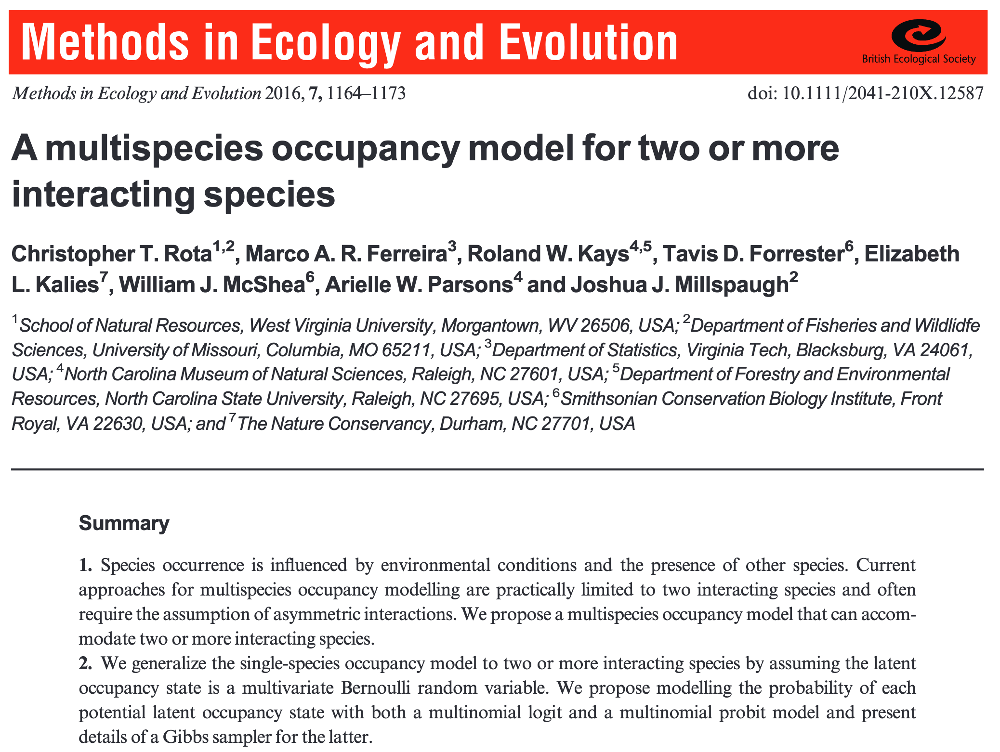
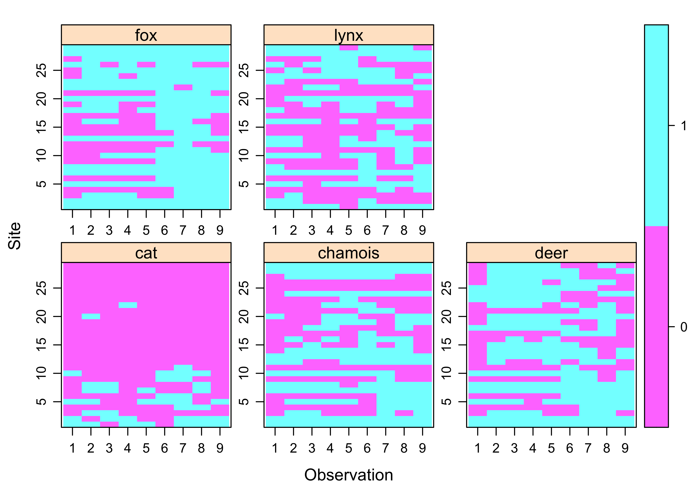
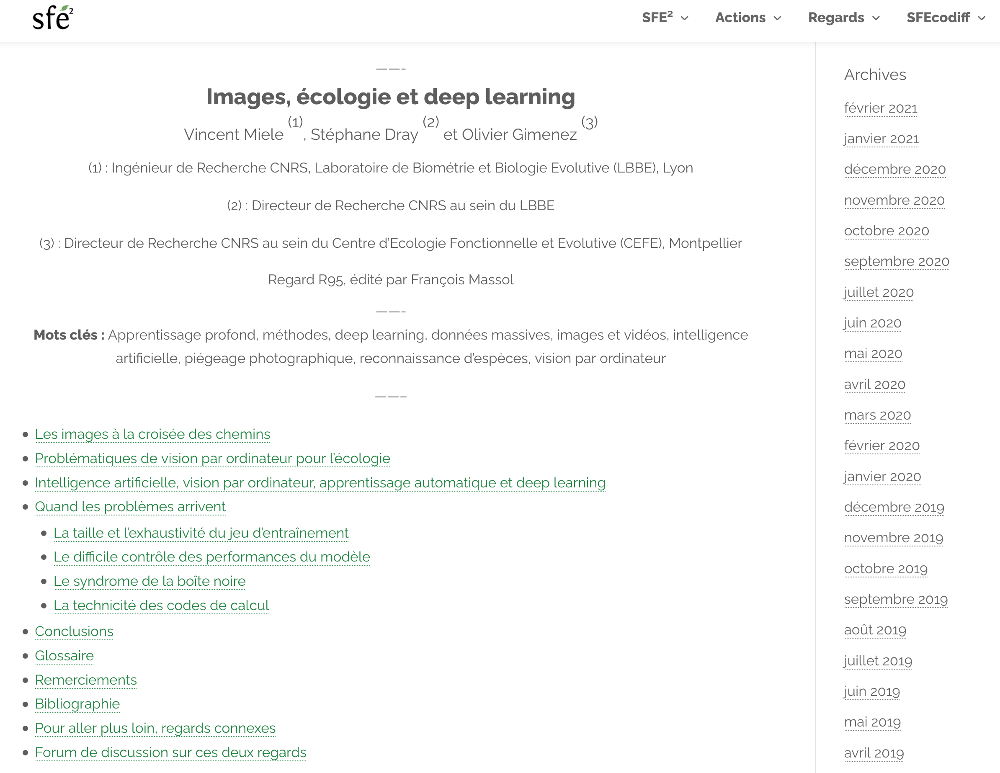
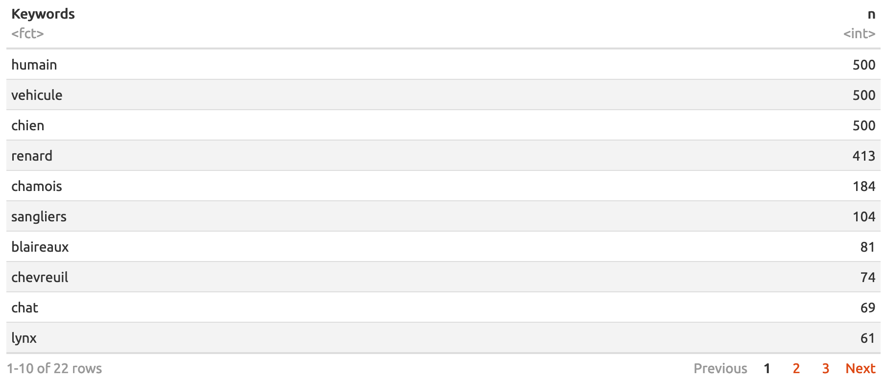
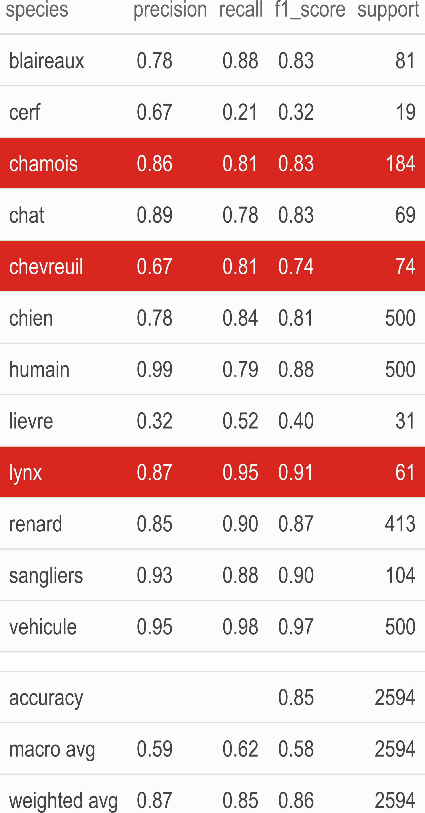
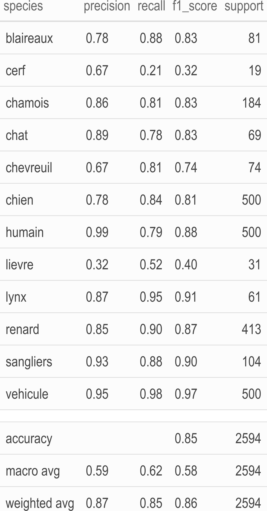
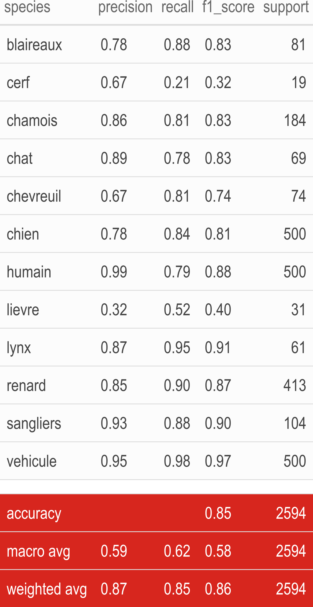

class: center, middle
background-image: url(img/illustration1bis.jpg)
background-size: cover 
<br>
### Deep learning, false negatives/positives and predator-prey interactions: Peregrinations in `R`

.large[Olivier Gimenez [`r icon::fa_twitter()`](https://twitter.com/oaggimenez) [`r icon::fa_github()`](https://github.com/oliviergimenez) | Rencontres R 2021 [`r icon::fa("home")`](https://rr2021.sciencesconf.org/)] 

.footnote[
`r icon::fa("camera")` Alain Laurent & David Hackel]

```{r setup, include=FALSE}
options(htmltools.dir.version = FALSE)
library(tidyverse)
library(kableExtra)
```

```{r xaringan-themer, include=FALSE, warning=FALSE}
library(xaringanthemer)
style_duo(primary_color = "#1F4257", secondary_color = "#F97B64")
```

???

+ Hi My name is Olivier Gimenez. I'm a CNRS scientist at the Centre for Functional and Evolutionary Ecology in Montpellier (France). 

+ I'm gonna tell you about my first steps in deep learning (DL) with R, and the study of species interactions w/ camera traps. 


---
class: inverse, left, top
background-image: url(img/grabbytheballs.jpg)
background-size: cover 

## Predator-prey interactions

.footnote[
`r icon::fa("camera")`[Sarah Skinner](https://www.comedywildlifephoto.com/gallery/finalists/2019_finalists.php)]


???

+ I work on pred-prey relationships, interactions between species that drive large mammals communities. 

<!-- + We aim at understanding how the environment, pred and prey interact with each other.  -->


---
class: left, middle
background-image: url(img/juramountains.jpg)
background-size: cover 

<br><br><br><br><br><br><br><br><br><br>

<li>Coll. A. Chaine, M. Kervellec, V. Miele, [OFB](https://ofb.gouv.fr/) and Ain/Jura hunting associations
<!-- <li>Precious help from folks at [Montpellier Bioinformatics and Biodiversity (MBB)](https://mbb.univ-montp2.fr/MBB/index.php) -->

.footnote[
`r icon::fa("camera")` [Peter Bucks](https://twitter.com/peterbucks)]

???

+ This is joint work w/ Anna Chaine and Maëlis Kervellec, Vincent Miele, colleagues from the French Office for Biodiversity and game federations from Ain and Jura counties.  

<!-- + In passing, I would also like to thank colleagues from the Montpellier Bioinformatics Biodiversity platform who've been very helpful in using GPU machines. -->

---
class: left, top
background-image: url(img/lynx_kittens.JPG)
background-size: cover

???

+ Colleagues from OFB and game federations collect data on species of interest, with camera traps set up at strategic places. 

+ On both sides of forest paths where species tend to pass, like on the pix a lynx w/ her kittens.  

--

* Non-invasive monitoring

???

+ This method is non-invasive, in other words we do not need to physically capture the individuals.

--

* Gigas of pix to tag by hand

???

+ The thing is that we get tons of pictures that we have to tag with a species label. 

--

* Deep learning?

???

+ Here it comes deep learning.

---
class: center, middle
background-image: url(https://miro.medium.com/max/3840/1*oB3S5yHHhvougJkPXuc8og.gif)
background-size: contain 

.footnote[
Source: [Andrew Ng](https://en.wikipedia.org/wiki/Andrew_Ng)]


???

+ The idea is to feed algo with pix as inputs, and get the species ID as outputs. 


<!-- --- -->
<!-- class: center, top -->
<!-- background-image: url(img/imaginecology.png) -->
<!-- background-size: contain  -->
<!-- ## <https://ecostat.gitlab.io/imaginecology/> -->

<!-- <br><br><br><br><br><br><br><br><br><br><br><br><br> -->

<!-- #### Kuddos to [Vincent Miele](https://lbbe.univ-lyon1.fr/-Miele-Vincent-.html) and [Gaspard Dussert](https://www.linkedin.com/in/gaspard-dussert/?originalSubdomain=fr) ! -->


<!-- ??? -->

<!-- + For my first steps in deep-learning, I used imaginecology a website we develop w/ our French group in Statistical Ecology.  -->

<!-- + Check it out, there is an intro to deep learning in video the one and only Vincent Miele, and several tutorials.  -->

---
class: right, top
background-image: url(img/illustration1.jpg)
background-size: cover 

.footnote[
`r icon::fa("camera")` [Sylvain Gatti](https://www.linkedin.com/in/sylvaingatti/?locale=fr_FR)]

???

<!-- <!-- + Going back to the lynx.  --> -->

<!-- -- -->

I used the [Python/PyTorch fastai deep learning library](https://github.com/fastai/fastai)

???

+ For my analyses, I used the fast-ai library which relies on Python and its library Pytorch. 

--

It comes with an [`R` interface](https://eagerai.github.io/fastai/) that provides `R` wrappers to fastai.

```{r, out.width="50%", echo = FALSE}
knitr::include_graphics("img/fastai.png")
```

???

+ The advantage of this library is that it comes with a R package that provides a bunch of functions to use it. 

---
class: inverse, right, top
background-image: url(https://blog.nationalgeographic.org/wp-content/uploads/2013/08/01-Snapshot-originals-3-Slide61.gif)
background-size: cover 

## Results?


???

What are the results I got?

---
class: inverse, center, middle

## Transfer learning on a site (Jura)

???

First, I did some transfer learning on a study site in the Jura county where we had a ton of pictures manually tagged. 

---
## Some `R` code

Load the `fastai` library:
```{r eval = FALSE}
library(fastai)
```

???

+ To do so, you only need a few lines of R code. 

+ Load the fast-ai library first.  

---
## Some `R` code

Load and apply transformations on training/validation pictures:
```{r eval = FALSE}
dls <- ImageDataLoaders_from_folder(
  path = "pixdir/pix/",
  train = "train",
  valid = "valid",
  item_tfms = Resize(size = 460), # resize pix
  batch_tfms = list(aug_transforms(size = 224, 
                                   min_scale = 0.75), # flip, rotate, 
                                                      # zoom, warp, 
                                                      # light transf.
                    Normalize_from_stats( imagenet_stats() )))
```

???

+ Then load the pictures that we split into a training and validation datasets, and apply all sorts of treatments to these pictures.  

---
## Some `R` code

Get the model architecture, a resnet50:
```{r eval = FALSE}
learn <- cnn_learner(dls = dls, 
                     arch = resnet50(), 
                     metrics = list(accuracy, error_rate))
```

???

+ Get the pre-trained model architecture, here a resnet50.

---
## Some `R` code

Train using CPU or GPU:
```{r eval = FALSE}
one_cycle <- learn %>% 
  fit_one_cycle(n_epoch = 20, 
                cbs = SaveModelCallback(every_epoch = TRUE, 
                                        fname = 'model'))
one_cycle
```

???

+ Then continue training the model with our data. 

+ I used 20 epochs and saved the model after each epoch for later use. 

---
class: center, middle
background-image: url(img/lynxplusprey.png)
background-size: contain 


???

+ The results are rather good. We manage to classify the lynx and its main prey, chamois and roe deer, with a satisfying level of certainty.

---
class: inverse, center, middle

## Automatic tagging in another site (Ain)


???

+ Then, I used my freshly trained model to tag automatically a bunch of pictures we had on another study site, in the Ain county. These pictures were also manually tagged, hence we knew the species for sure. 

---
## Some `R` code

Tag pictures based on the model we trained:
```{r eval = FALSE}
learn %>% 
  predict(pix_to_be_tagged)
```

???

+ In R, we use the predict function to tag a new pix with the model we've trained in previous steps.

---
class: middle, center
background-image: url(img/blackboard.jpg)
background-size: cover 

```{r echo = FALSE, message = FALSE, warning = FALSE}
load(here::here("dat/", "pixAinannot.RData"))
library(highcharter)
dout <- unclass(table(tt_final$observed,tt_final$predicted))
perf_prediction <- hchart(dout, label = TRUE) %>%
    hc_yAxis(title = list(text = 'Actual')) %>%
    hc_xAxis(title = list(text = 'Predicted'),
             labels = list(rotation = -90)) %>%
    hc_add_theme(hc_theme_chalk())
perf_prediction
```

???

+ The results are best displayed with a confusion matrix, with species that are predicted by the algo in columns, and the species that are actually in the pictures in rows. 

+ Let us focus on lynx.  

+ A false negative is for example a picture with a lynx but we predict another species on it. A false positive is a picture without any lynx but we predict that there is a lynx on it. 

+ Starting with false negatives, in rows, we see that lynx is confused with cat and fox. 

+ Now to false positives, in columns, we predict lynx on pictures where we have actually deer and fox.

---
class: center, middle
background-image: url(https://media.giphy.com/media/j4rPM934CLIvC/giphy.gif)
background-size: cover 

???

+ This is disapointing, but past the frustration, one may ask is it really a big problem, is our answer to the ecological question of pred-prey interactions affected by these errors. 


---
background-color: white

```{r echo = FALSE}

```

???

+ To assess bias, we used statistical models that allow infering co-occurrences between species while accounting for imperfect detection - so-called occupancy models. 

---

## Some `R` code

Load `unmarked` to fit SDMs w/ interactions and imperfect detection:
```{r eval = FALSE}
load(unmarked)
```

???

+ You can fit these models in R using the unmarked package. 

---
background-color: white

<br>

```{r echo = FALSE}

```

???

+ Here is a snapshot of the data, one panel per species, with camera traps in rows, time in columns. Detections are in blue, and non-detections in pink.  

---
## Some `R` code

Fit a model w/ interactions bw lynx, roe deer and chamois, w/ cats and fox too:
```{r eval = FALSE}
# Marginal and interaction effects
occFormulas <- c('~1','~1','~1','~1','~1','~1','~1','~0',...,'~0') 

# Detection probabilities
detFormulas <- c('~1','~1','~1','~1','~1')

# Fit occupancy model
fit <- occuMulti(detformulas = detFormulas,
                 stateformulas = occFormulas,
                 data = data,
                 method = "Nelder-Mead")
fit
```

???

+ With these data, we build models to test our hypothesis about interactions. 

+ Here I will look into interactions between lynx and its prey only.  

+ We also consider species-specific detection probabilities. 

+ And we fit our model to the data using max lik.  


---
class: inverse, center
background-color: white

### Conditional occupancy probabilities

```{r echo = FALSE}
knitr::include_graphics("img/conditional_occ.png")
```

???

+ We get occupancy prob for lynx, given presence/absence of its prey. 

+ In red, the estimates are from the model fitted to the pix that were manually tagged, in other words wo/ false neg or false pos. Ground truth.  

+ In blue-gray, same model, fitted to the pix that were automatically tagged by our trained model w/ CNN. 

+ There is a small bias in the occupancy prob of lynx given the presence of both its prey when we rely on automatic tagging. 

+ The difference in estimates is small, and we may well decide to ignore this bias and save a lot of time by not tagging pix manually.

+ Now we have a bigger issue w/ the occupancy prob for lynx given roe deer presence and chamois absence, which is clearly under-estimated.

---
class: left, top
background-image: url(https://media.giphy.com/media/3o7btPCcdNniyf0ArS/giphy.gif)
background-size: cover

# Conclusions

???

+ To conclude,

--
+ Generalisation to another site is challenging.

???

+ Training a model on one site, and predict on another site is difficult. Known result (see work by S. Beery). 

--
+ Lack of diversity in training dataset? More pix to come.

???

+ Our problem is most likely due to a lack of diversity in the training dataset. We're in the process of adding more pix, more diverse, and redo the training.  

--
+ Do not lose sight of the ecological question.

???

+ Easy to get lost in deep learning, and lose sight of the ecological question. If I can live with small bias on ecological indicators, better to stay on course, and go with not-too-perfect performances of the algo and save precious time in tagging. 

<!-- -- -->
<!-- + Ongoing work: Accounting for both false negatives and false positives.  -->

<!-- ??? -->

<!-- + This being said, we can do better. I'm working on models with $>2$ species interactions, accounting for false positives and false negatives.  -->

<!-- --- -->
<!-- background-color: white -->

<!-- ### [Regards de la SFEE](https://www.sfecologie.org/regard/r95-fev-2021-miele-dray-gimenez-deep-learning/) -->
<!-- ```{r echo = FALSE, out.width="95%"} -->
<!--  -->
<!-- ``` -->

<!-- ??? -->

<!-- Further reading.  -->


---
class: center, bottom
background-image: url(img/predictions.jpg)
background-size: cover 

.footnote[
Thank you!
]


???

Thank you for listening. 


---
class: center middle

# Bonus slides


---

### training dataset


---

### validation dataset



---
class: center, middle
background-color: white


```{r echo=FALSE, message=FALSE, warning=FALSE}
options(knitr.kable.NA = '')
readr::read_csv2(here::here("dat","perf_fastai.csv")) %>% 
  janitor::clean_names() %>%
  kbl() %>%
  kable_paper() %>%
  kable_styling(full_width = F, font_size = 20) %>%
  row_spec(13, bold = T, color = "white", background = "white") %>%
  row_spec(14:16, bold = T) %>%
  column_spec(1, bold = TRUE) %>%
  save_kable(here::here("img", "perf1.png"),
             zoom = 5)
```

<!-- {width=80%, height=80%} -->



???

Four metrics are given.

+ Precision is the ratio tp / (tp + fp) where tp is the number of true positives and fp the number of false positives. It quantifies the ability of the classifier not to label as positive a sample that is negative. The question that this metric answers is of all pix that labeled as positive, how many actually were positive?

+ The recall is the ratio tp / (tp + fn) where tp is the number of true positives and fn the number of false negatives. The recall is intuitively the ability of the classifier to find all the positive samples. The question recall answers is: of all the pix that were positive, how many did we label?

+ The f1-score can be interpreted as a weighted average of the precision and recall, it reaches its best value at 1 and worst score at 0. The f1-score weights recall more than precision by a factor of 1, meaning that recall and precision are equally important. f1-score is 2 * (recall * precision) / (recall + precision)

+ The support is the number of occurrences of each class in y_true (ground truth or correct target values).


---
class: center, middle
background-color: white


```{r echo=FALSE, message=FALSE, warning=FALSE}
options(knitr.kable.NA = '')
readr::read_csv2(here::here("dat","perf_fastai.csv")) %>% 
  janitor::clean_names() %>%
  kbl() %>%
  kable_paper() %>%
  kable_styling(full_width = F, font_size = 20) %>%
  row_spec(13:16, bold = T, color = "white", background = "#D7261E") %>%
  row_spec(13, bold = T, color = "white", background = "white") %>%
  row_spec(14:16, bold = T) %>%
  column_spec(1, bold = TRUE) %>%
  save_kable(here::here("img", "perf2.png"),
             zoom = 5)
```

<!-- {width=80%, height=80%} -->



???

+ macro avg: Calculate metrics for each label, and find their unweighted mean. This does not take label imbalance into account.

+ weighted avg: Calculate metrics for each label, and find their average weighted by support (the number of true instances for each label). This alters ‘macro’ to account for label imbalance.

+ Accuracy is the most intuitive performance measure and it is simply a ratio of correctly predicted observation to the total observations, it is (tp + tn)/(tp + tn + fp + fn)


---
class: center, middle
background-color: white


```{r echo=FALSE, message=FALSE, warning=FALSE}
options(knitr.kable.NA = '')
readr::read_csv2(here::here("dat","perf_fastai.csv")) %>% 
  janitor::clean_names() %>%
  kbl() %>%
  kable_paper() %>%
  kable_styling(full_width = F, font_size = 20) %>%
  row_spec(c(3,5,9), bold = T, color = "white", background = "#D7261E") %>%
  row_spec(13, bold = T, color = "white", background = "white") %>%
  row_spec(14:16, bold = T) %>%
  column_spec(1, bold = TRUE) %>%
  save_kable(here::here("img", "perf.png"),
             zoom = 5)
```

<!-- {width=80%, height=80%} -->


---
class: inverse, center
background-color: white
### Marginal occupancies

```{r echo = FALSE, out.width = "85%"}
knitr::include_graphics("img/marginal_occ.png")
```


---
class: center, top
background-image: url(img/imagine_conf.png)
background-size: cover

<br><br><br>

### <https://imaginecology.sciencesconf.org/>


???

+ Toujours avec le GDR EcoStat, nous avons organisé en novembre des rencontres autour de l'utilisation des méthodes d'apprentissage profond pour l'analyse d'images et de sons en écologie.

+ A cette occasion, Vincent Miele a donné un exposé introductif filmé dans lequel il explique les concepts généraux, les réseaux de neurones et le vocabulaire technique. 


